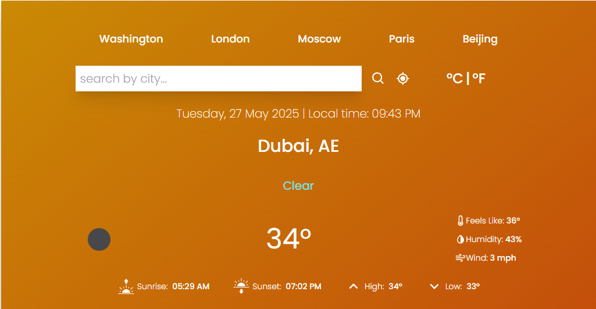
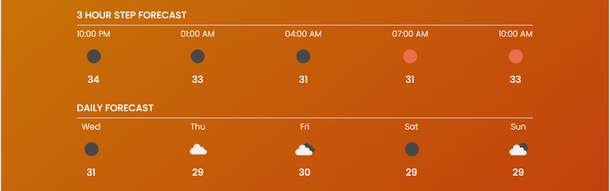

# 🌦️ Live Weather App

**Live Weather App** is a fast, responsive, and modern weather application built using **React**, **Vite**, and **Tailwind CSS**. It allows users to get real-time weather data such as temperature, humidity, wind speed, and pressure for any city around the world.

---

## 🚀 Features

- 🔍 Search for current weather by city name
- 🌡️ Real-time temperature display
- 💧 Shows humidity, wind speed, and pressure
- 🕒 Displays local time using Luxon
- 🌤️ Dynamic weather icons for clarity
- 🔔 Toast notifications for errors or events
- 📱 Fully responsive design for all devices

---

## 🛠️ Tech Stack

| Category      | Tools/Packages                               |
|---------------|-----------------------------------------------|
| Framework     | [React](https://reactjs.org/)                |
| Build Tool    | [Vite](https://vitejs.dev/)                  |
| Styling       | [Tailwind CSS](https://tailwindcss.com/)     |
| Date/Time     | [Luxon](https://moment.github.io/luxon/)     |
| UI Icons      | [React Icons](https://react-icons.github.io/react-icons/) |
| Notifications | [React Toastify](https://fkhadra.github.io/react-toastify/) |
| Linting       | ESLint with React, React Hooks, and Refresh plugins   |

---

## 📦 Installation & Setup

### 1. Clone the Repository

```bash
git clone https://github.com/your-username/Live-Weather-App.git
cd Live-Weather-App


### 2. Install Dependencies

npm install

### 3. Add Your Weather API Key

Sign up at OpenWeatherMap (or your preferred weather API)

Create a .env file in the root:
VITE_WEATHER_API_KEY=your_api_key_here


### 4. Run the Development Server

npm run dev

Visit http://localhost:8080 to view the app.


##🌐 Live Demo

Link : https://weathering-wave.netlify.app/


## 📸 Screenshots






##🧠 What I Learned

React component design and state management

Integrating third-party APIs with environment variables

Tailwind for fast, clean styling

Optimizing apps using Vite

Displaying dynamic weather data in real-timeWorking with real-time APIs

React Hooks and state management

Tailwind CSS for rapid UI development

Environmental variables and secure API integration

Vite for fast development experience


##🤝 Contributing

Pull requests are welcome. For major changes, please open an issue first.


### Note


Currently, two official plugins are available:

- [@vitejs/plugin-react](https://github.com/vitejs/vite-plugin-react/blob/main/packages/plugin-react/README.md) uses [Babel](https://babeljs.io/) for Fast Refresh
- [@vitejs/plugin-react-swc](https://github.com/vitejs/vite-plugin-react-swc) uses [SWC](https://swc.rs/) for Fast Refresh
